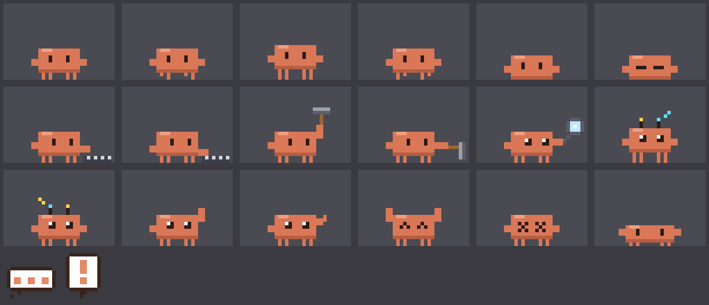

# Claude Buddy

A tiny pixel-art Claude critter that lives along the bottom of your Mac's screen. It wanders over whatever apps you have open without ever stealing focus or clicks, and it comes alive when you're working with **Claude Code**: pacing while Claude thinks, typing when it runs commands, hammering when it edits code, waving when Claude needs your permission, and doing a victory backflip when a task finishes.



> An unofficial fan project. It isn't affiliated with or endorsed by Anthropic.

## Features

- **Stays out of your way.** A transparent, click-through overlay that never becomes the active window. Your keyboard and mouse keep going to the app you're using.
- **Knows where the floor is.** It walks on top of the Dock normally, and drops to the very bottom of the screen when the front app is full-screen or maximized.
- **Reacts to Claude Code** through Claude Code hooks:

  | Claude Code event | Buddy |
  |---|---|
  | Session starts | Wakes up and waves |
  | You send a prompt | Paces around with a thought bubble 💭 |
  | `Bash` | Types on a little keyboard |
  | `Edit` / `Write` | Swings a hammer (with sparks) |
  | `Read` / `Grep` / `Glob` | Inspects things with a magnifying glass |
  | `WebFetch` / `WebSearch` / MCP tools | Antennae pop up and beam signals |
  | Needs your permission | Stops, faces your cursor, waves, and shows a "!" bubble |
  | Task finished | Jumps, backflips, and bursts into confetti 🎉 |
  | Tool error | Dizzy, with stars circling its head |
  | Nothing for 5 minutes | Sits, then falls asleep 💤 |

- **Pettable.** Hold **⌥ Option** and click the buddy to pet it (hearts ❤️). Hold ⌥ and drag to pick it up, then flick to throw it. It bounces off the screen edges.
- **Notices your cursor.** Its eyes follow the cursor, and it turns around if the cursor is behind it. Rest the cursor near the buddies and the closest one trots over and hops around playfully. Swipe the mouse fast right past one and it jumps and runs off.
- **A buddy for every session.** The main buddy acts out your first Claude Code session. Each additional session drops in its own buddy, with its own hat, acting out only that session. So when one waves for permission, you know which session needs you. Hover a buddy to see a name tag with its project folder. When a session ends, its buddy waves and walks off-screen. Buddies that walk into each other stop to wave.
- **Climbs your windows.** The top edge of any app window (Finder, Terminal, anything) is a ledge. Idle buddies leap up onto one, stroll along it, sit, and hop back down. Drag the window and they ride along; close or minimize it and they tumble off. They only stand on the parts of an edge you can see, not the parts hidden behind other windows. You can also ⌥-drag a buddy and drop it onto a window.
- **Buddies together:**
  - Buddies that meet **high-five**.
  - Now and then idle buddies play **tag**. The tagger dashes away, and the new "it" counts to three before chasing. There are no tag-backs for a couple of seconds, and a buddy that's cornered leaps over whoever's "it".
  - When a session finishes, its buddy celebrates and the other idle buddies **cheer** from the sidelines.
  - When two or more sessions **finish around the same time**, everyone forms a **conga line**. Buddies up on windows jump down to join.
  - **Piggyback:** ⌥-drag one buddy and drop it on another's head to ride along. Stacks go three high.
- **Dances to your music.** When Spotify or Apple Music is playing, idle buddies dance in sync with floating music notes, and standing buddies bob along. Hover the main buddy while it dances to see the song. The apps don't report tempo, so each song gets a steady made-up beat (96–132 BPM, the same every time for a given song) instead of real beat-matching. Buddies start dancing the next time you press play, skip, or pause.
- **Hats and seasons.** Session buddies wear party hats, top hats, beanies, cowboy hats, crowns, propeller caps and flowers. The main buddy dresses for the season:

  | When | Main buddy |
  |---|---|
  | December | Santa hat, with snowflakes drifting around it |
  | October | Witch hat and Halloween-colored confetti |
  | Valentine's week | Heart bow and pink confetti |
  | St. Patrick's (Mar 15–17) | Leprechaun hat and green confetti |
  | April–May | Flower crown |
  | New Year's, and its "birthday" (the day you installed it) | Party hat |

  You can also pick any hat for it from the menu.
- **Light on resources.** Uses about 1% CPU. See "Performance" below.
- Respects **Reduce Motion** (no flips or wobble, fewer hops).

## Requirements

- A Mac running macOS 14 Sonoma or later (Apple Silicon or Intel)
- Claude Code (CLI or desktop app) for the reactions. Without it the buddy still wanders around.

## Install

Pick whichever is easiest.

### Option 1: Ask Claude Code to do it

Paste this into Claude Code:

```text
Install Claude Buddy for me from https://github.com/EmberGuild-Labs/Claude-Buddy.
Clone it, read its README and CLAUDE.md, then run ./scripts/install.sh. Check that
`curl http://127.0.0.1:47823/claude-buddy/ping` returns "claude-buddy ok", and tell me to
restart my other Claude Code sessions so they pick up the new hooks.
```

### Option 2: One-line installer (builds from source)

```bash
curl -fsSL https://raw.githubusercontent.com/EmberGuild-Labs/Claude-Buddy/main/scripts/install.sh | bash
```

This downloads the source, builds the app, copies it to `/Applications`, connects Claude Code by adding hooks to `~/.claude/settings.json` (after backing that file up), and launches it. Add `-s -- --no-hooks` after `bash` to skip the Claude Code step.

Building needs Apple's free developer tools. If you don't have them, the installer tells you to run `xcode-select --install` first. An app you build yourself opens without any Gatekeeper warnings.

### Option 3: Download the app

1. Download **ClaudeBuddy.zip** from the [latest release](https://github.com/EmberGuild-Labs/Claude-Buddy/releases/latest) and unzip it.
2. Drag **ClaudeBuddy.app** into **Applications**.
3. Open it. The app isn't notarized by Apple, so macOS blocks it the first time. Go to **System Settings → Privacy & Security**, scroll down, and click **Open Anyway** next to the Claude Buddy message. (Or run `xattr -dr com.apple.quarantine /Applications/ClaudeBuddy.app` in Terminal.)
4. Click the buddy icon in the menu bar → **Install Claude Code Hooks…**, then restart any open Claude Code sessions.

### Building it yourself

```bash
git clone https://github.com/EmberGuild-Labs/Claude-Buddy.git
cd Claude-Buddy
./scripts/build-app.sh --install     # builds build/ClaudeBuddy.app and copies it to /Applications
open /Applications/ClaudeBuddy.app
```

Then use the menu-bar icon → **Install Claude Code Hooks…**, or run `/Applications/ClaudeBuddy.app/Contents/MacOS/ClaudeBuddy --install-hooks`. Restart any Claude Code sessions that are already open, because hooks are read when a session starts. Your settings are backed up to `settings.json.claude-buddy-backup-<timestamp>`, and your other settings and hooks are left alone.

Optionally, turn on **Launch at Login** from the menu.

## Usage

Menu-bar menu:

| Item | What it does |
|---|---|
| Status lines | What Claude is doing, whether hooks are installed, where the floor is, and server status |
| Show Buddy | Hide or show the buddy (hiding also pauses its frame loop) |
| Quiet Mode | Ignore Claude Code events; the buddy just wanders |
| Size | Small / Medium / Large |
| Hat | Seasonal (automatic), a specific hat, or no hat, for the main buddy |
| Extra Buddy per Session | Turn session buddies off to have the main buddy show all sessions combined |
| Cursor Reactions | Eye-tracking, coming over to play, and getting startled |
| Climb onto Windows | Let buddies hop onto app windows |
| Dance to Music | Dance when Spotify or Apple Music is playing |
| Display | Walk on the main display, or follow the mouse between displays |
| Try an Animation | Preview reactions without Claude Code. **Every buddy** acts out the demo together (thinking, typing, waving for permission, celebrating, dancing…). Also includes "Game of Tag", "Conga Line" (both bring in pretend playmates if needed), and "Add a Session Buddy" (a pretend 30 s session) |
| Dismiss Extra Buddies | Sends every extra buddy off-screen and keeps the main one. Pretend demo sessions end. Real sessions keep running without a buddy (their events go to the main buddy) until you start a new session |
| Install / Remove Claude Code Hooks | Add or remove the hooks in `~/.claude/settings.json` |
| Launch at Login | Start automatically |

**Petting:** hold ⌥ while hovering the buddy. The cursor turns into a hand. Click to pet, or drag to carry and flick to throw.

### Uninstalling

1. Menu → **Remove Claude Code Hooks…** (or run `ClaudeBuddy --uninstall-hooks`)
2. Quit the app and delete `/Applications/ClaudeBuddy.app`

## How it works

```
Claude Code ──hook (curl)──▶ 127.0.0.1:47823 ──▶ ClaudeActivity ──▶ BuddyStage (brain + physics + Core Animation)
                                                                          ▲
                              OverlayController (window, floor detection)─┘
```

| File | Role |
|---|---|
| `main.swift` | App delegate, plus command-line flags (`--install-hooks`, `--uninstall-hooks`, `--render-icon`, `--render-sprites`) |
| `Overlay.swift` | The full-screen click-through `NSPanel`, floor placement (Dock top vs. screen bottom), and window ledge detection |
| `MusicWatcher.swift` | Knows when Spotify or Apple Music is playing, from their system-wide notifications |
| `SelfTest.swift` | `--self-test`: simulates sessions, ledges, games, piggyback and dancing off-screen, and checks the results |
| `BuddyStage.swift` | The whole-screen stage holding all the buddies: one display link, matching sessions to buddies, window ledges, games (tag, conga), the shared beat, cursor tracking, ⌥-mouse routing, effects |
| `Buddy.swift` | One buddy: behavior state machine, physics (floor, ledges, leaps, piggyback), cursor reactions, games, dancing, poses, name tag |
| `Hats.swift` | Hat art and the seasonal calendar |
| `BuddyArt.swift` / `PixelArt.swift` | All pixel art is drawn in code, from part-based `Pose`s, and cached |
| `ClaudeActivity.swift` | Tracks each session's state and project folder, plus a combined state |
| `EventServer.swift` | Minimal HTTP server bound to `127.0.0.1` only (Network.framework) |
| `HookInstaller.swift` | Safely edits `~/.claude/settings.json` (idempotent, backs up first) |
| `MenuController.swift` | Menu-bar UI and demos |

### The hook

Every hooked event runs:

```bash
curl -s -m 1 -o /dev/null -H 'Content-Type: application/json' -H 'Expect:' \
  --data-binary @- http://127.0.0.1:47823/claude-buddy/event >/dev/null 2>&1 || true
```

- It **never prints anything**. Output from `UserPromptSubmit` and `SessionStart` hooks gets added to Claude's context, so staying silent matters.
- It **always exits 0** and times out after 1 s, so it can't block or fail Claude Code, even if the buddy isn't running.
- `-H 'Expect:'` stops curl from waiting on a `100-continue` for large payloads (such as `Read` results).

Hooked events: `SessionStart`, `SessionEnd`, `UserPromptSubmit`, `PreToolUse`, `PostToolUse`, `Notification`, `Stop`, `SubagentStop`.

Health check: `curl http://127.0.0.1:47823/claude-buddy/ping` returns `claude-buddy ok`.
Behavior tests: `ClaudeBuddy --self-test` runs every buddy behavior on a simulated clock and prints PASS/FAIL (exit code 1 on failure).
Debugging: `curl http://127.0.0.1:47823/claude-buddy/status` returns a JSON snapshot of every buddy: its mode, hat, session and position, plus the frame count.

## Notes and decisions

- **Native Swift/AppKit, no Electron.** It's small, has no dependencies, and gives the window-level control a desktop pet needs.
- **Hooks instead of guessing.** Claude Code hooks give exact, low-latency events (which tool, which session) with no screen scraping or process polling. The server listens on loopback only.
- **Why the window never ignores you:** it's a non-activating `NSPanel` at status-bar level, on all Spaces including full-screen ones, with `ignoresMouseEvents = true`. The frame loop polls ⌥ and the cursor position. Neither needs Accessibility or Input Monitoring permission. Only while ⌥ is held over the buddy does the window accept the mouse, so you can pet it.
- **Floor detection:** every 0.75 s, and on app or Space switches, it reads the frontmost app's window bounds with `CGWindowListCopyWindowInfo`. Reading bounds needs no Screen Recording permission. If a window fills the usable screen area, the floor becomes the screen's bottom edge; otherwise it's the top of the Dock. When the floor changes, the buddy falls or hops to the new floor.
- **Performance:**
  - The first version used SpriteKit and sat at around 6% CPU, because the Metal render loop costs something every frame even for a tiny scene.
  - Switching to plain Core Animation layers moved compositing to the WindowServer.
  - A "small window that follows the buddy" experiment was *worse* (about 5%): moving a window every frame is expensive. So the window spans the screen width and never moves.
  - The frame rate adapts: 30 fps while moving, 15 while standing, 10 while asleep.
  - Result: about 1% CPU idle or pacing, with brief spikes during confetti.
- **Tool flicker:** fast tools like `Read` start and finish within milliseconds. The buddy remembers the last tool for a few seconds and finishes each 2–4 s "bit" before switching, so animations don't stutter.
- **Permission prompts:** the buddy waves until the next event for that session arrives. After you approve a long-running command, it may keep waving until that command finishes, because no hook fires in between.
- **Art:** an original Claude-inspired critter in Claude's clay orange (`#D97757`), drawn procedurally so new poses are a few lines of code. `--render-sprites file.png` writes a contact sheet.
- **Session buddies:** the main buddy keeps its session until that session ends, so buddies never swap jobs mid-task. Up to 6 extra buddies can appear, and their hats are handed out so no two match. A session with no events for 45 minutes counts as gone, which covers a terminal closed without a clean exit.
- **Window ledges:** the app lists on-screen windows front to back, and each window's top edge becomes a ledge minus any part covered by a window in front of it. Reading window positions needs no permissions. It rescans about once a second, or 20 times a second while a buddy is on or leaping between windows, so riding a dragged window stays smooth. A scan takes about 0.4 ms, and it stops while the display sleeps. To make this work, the overlay now covers the whole screen but still passes every click through.
- **Music without permissions:** Spotify and Apple Music announce play and pause through system-wide notifications, which any app can listen to. Asking the players directly would trigger a permission prompt, and real beat detection would need to record system audio. Neither seemed worth it for a desktop pet.
- **Games are coordinated by the stage:** it decides when tag or a conga line happens and who's "it". Each buddy only plays its own part, and drops out if its Claude session gets busy.
- **Cursor reactions without special permissions:** the frame loop just reads the cursor position. A "fast swipe" is detected along the cursor's path between frames, so it still works at the 15 fps idle rate. Only the closest buddy comes over to play, and there are cooldowns so it doesn't get clingy.

## Development

```bash
swift build                                     # debug build
.build/debug/ClaudeBuddy                        # run without bundling
.build/debug/ClaudeBuddy --render-sprites out.png
echo '{"hook_event_name":"Stop","session_id":"x"}' | \
  curl -s --data-binary @- http://127.0.0.1:47823/claude-buddy/event   # trigger a celebration
```

The single-instance check and Launch at Login only work from the bundled `.app`.

Making a release (a universal Apple Silicon + Intel build, zipped):

```bash
./scripts/build-app.sh --universal --zip
gh release create v1.x.y build/ClaudeBuddy.zip
```


## Ideas for later

- Speech bubbles showing the tool name or a snippet of Claude's message
- Optional sound effects
- A menu-bar icon that shows Claude's status
- Auto-hide while screen sharing
